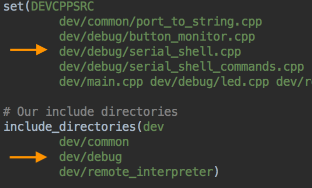
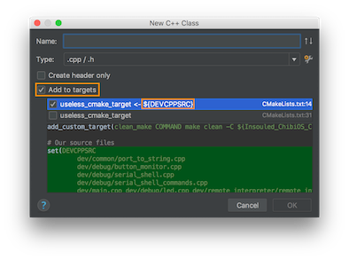

### 如何 新建/重命名/移动 c/cpp/h/hpp/目录

#### 1. 确保c/cpp文件在CMakeList.txt的`DEVCPPSRC`中，目录包含在CMakeList.txt的`include_directories`中。

CLion中新建文件时可以选择加入target，但目录仍需手动加入。

这些步骤让CLion能正常解析文件。

#### 2. 在dev.mk文件中，将c加入对应`CSRC`，将cpp加入对应`CPPSRC`，将目录加入对应`INC`。
