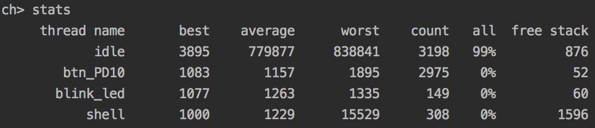

# Shell Manual

## ChibiOS Build-in Commands
Defined in os/various/shell/shell_cmd.c.

### echo
Echo message.

**Usage**: ```echo message```

### systime
Show system time.

**Usage**: ```systime```

### mem
Show memory usage summary.

**Usage**: ```mem```

### threads
Show threads.

**Usage**: ```threads```


# User-Defined Commands

### hello
Echo hello world.

**Usage**: ```hello```

### stats
Echo the CPU usage data and stack status of each threads.



**Usage**: ```stats```


## Remote Interpreter Unit Test

### pause
Pause the output of remote data.
**Usage**: ```pause```

### resume
Resume the output of remote data.
**Usage** ```resume```